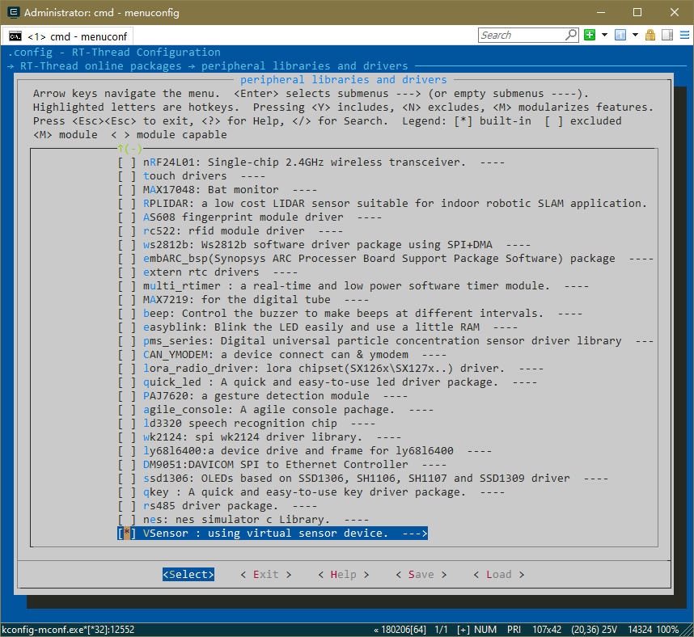
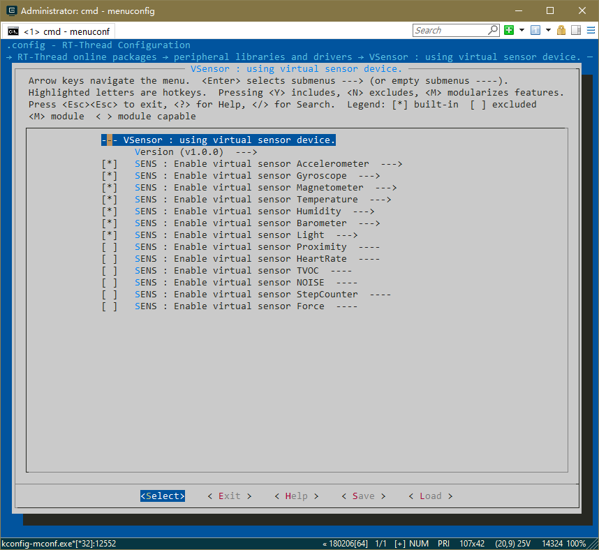

# vsensor

rt-thread虚拟传感器，基于RT-Thread Sensor框架。

## 传感器列表

```
/* Accelerometer */
/* Gyroscope */
/* Magnetometer */
/* Temperature */
/* Humidity */
/* Barometer */
/* Light */
/* Proximity */
/* HeartRate */
/* TVOC */
/* NOISE */
/* StepCounter */
/* Force */
```

## 使用说明

* 通过menuconfig，使能虚拟传感器
* 使能单个或多个传感器







## 维护地址
```
https://github.com/zhangsz0516/vsensor
zhangsz0516@163.com
```